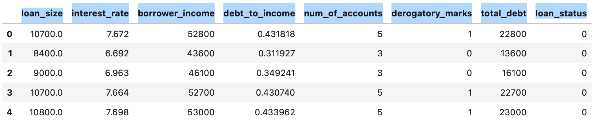
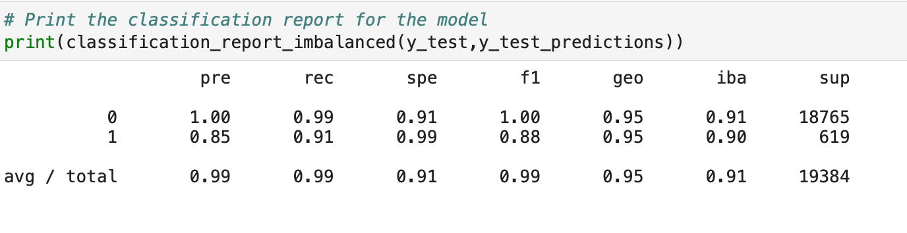
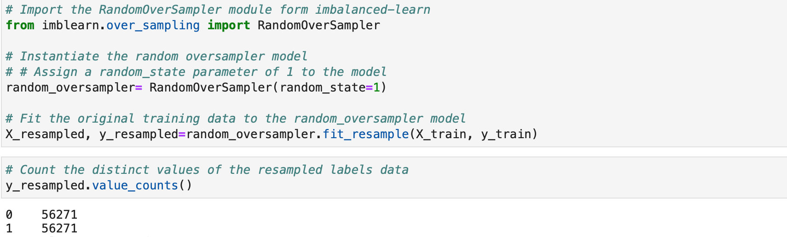
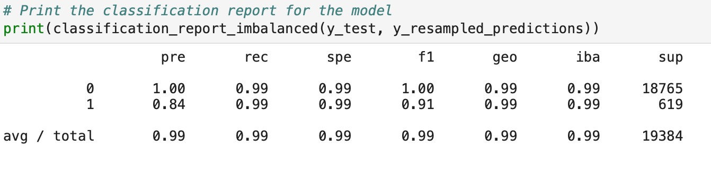

# Creditworthiness Identifier
This project builds a model that can identify creditworthiness of a borrower based on dataset of historical lending activity from a peer-to-peer lending services company and classify healthy and risky loans with a 0.99 sensitivity metric score achieved for both classes: healthy loans (0) and risky loans (1).


# Dataset 
The dataset includes historical lending activity from a peer-to-peer lending services company and includes the following features:
loan_size	interest_rate	borrower_income	debt_to_income	num_of_accounts	derogatory_marks	total_debt	loan_status




# Technologies 

This project leverages python 3.7 with the following packages:
* Pandas - for financial calculations
* Path - for identifying the file
* Imbalanced-learn- a python package offering a number of re-sampling techniques commonly used in datasets showing strong imbalance between classes.
* Scikit-  open source machine learning library for the Python programming language. It features various classification, regression and clustering algorithms 

# Installation guide

This project leverages Python 3.7 with the following libraries and dependencies 

``` python

pip install -U scikit-learn

conda install -c conda_forge imbalanced_learn
```

# Examples 

Classification report on the original data



---

Resampling the data to solve the imbalanced class problem using RandomOverSampler()



---

Classification report after the model has been fitted to the oversampled dataset



---

## Contributors
Brought to you by Ksenia Gorska as part of the UC Berkeley Extension Bootcamp: UCB-VIRT-FIN-PT-06-2021-U-B-MW 
Ksenia Gorska
 e-mail: kseniagorska@icloud.com 

[Ksenia Gorska - linkedin profile](https://www.linkedin.com/in/ksenia-gorska/)

---
## License

MIT

